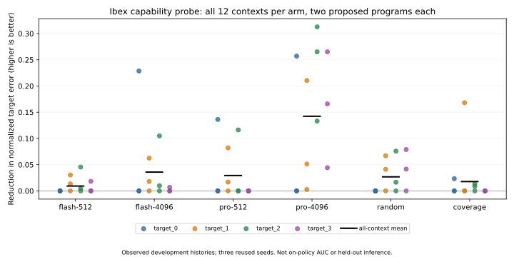

# Ibex capability probe — development results

Completed 2026-09-07. The controlled model × thinking probe found a promising
configuration: **Gemini 2.5 Pro with 4,096 thinking tokens** produced the largest
mean next-batch improvement. This is conditional proposal quality on observed
histories, not a full-search or held-out victory. Previous negative studies stand.

## What was held fixed

The [pre-call protocol](IBEX_CAPABILITY_V1_PROTOCOL.md) and manifest were frozen
at `0c5d1779`. Twelve contexts comprise four programmable-Ibex temporal targets
and three reused development seeds (600–602). Each context contains the first
six trials from the previous base-agent trajectory, selected by index rather
than success. All six arms propose two additional programs from that same history.
The 72 cells consume 144 requested slots, including failed candidates.

All four model arms receive the same grounded payload, workload grammar, target,
history, diagnostics and response schema. The CPU oracle, 4,096 semantic-operation
budget, 200,000-cycle measurement window, eight bins, normalization and 0.1
tolerance are unchanged. Temperature is 0.7 and top-p 0.95. The common output cap
is 16,384, deliberately larger than v4's 8,192; comparisons against older v4
scores are therefore not a pure model swap. Random and coverage receive the
same historical measurements. There are no repair attempts or discarded calls.

## Primary endpoint

Gain is the reduction from the best valid historical error to the best error
after the two proposals; no improvement yields zero. Higher is better. This is
not AUC and does not measure how a policy builds its own history over time.

| Arm | Mean gain ↑ | Mean remaining error ↓ | Contexts improved / 12 | Newly solved | Valid / 24 | Estimated USD |
|---|---:|---:|---:|---:|---:|---:|
| Flash-512 | 0.00931 | 0.32454 | 5 | 1 | 23 | 0.1534 |
| Flash-4096 | 0.03590 | 0.29795 | 6 | 1 | 24 | 0.2548 |
| Pro-512 | 0.02929 | 0.30456 | 4 | 0 | 22 | 0.6138 |
| Pro-4096 | 0.14234 | 0.19151 | 10 | 4 | 24 | 1.0386 |
| Random | 0.02674 | 0.30711 | 6 | 1 | 21 | 0 |
| Coverage | 0.01777 | 0.31608 | 4 | 1 | 23 | 0 |

One historical context was already solved for every arm; it is not counted as a
new solve. All seven rejected proposals failed the useful-work gate. There were
no schema, protocol or functional rejections. CPU costs above mean LLM charges,
not free simulation.



Pro-4096 newly solves `target_1-600`, `target_1-602`, `target_2-600` and
`target_3-602`. The latter two extend beyond the near-flat target: their errors
fall from 0.36131 to 0.09613 and from 0.30055 to 0.03534 respectively. It does
not solve target 0, and it leaves two target-0 contexts unimproved. The result
is not uniform success across temporal shapes.

Its mean gain exceeds Flash-512 in each seed group: 0.22467 versus 0.01593,
0.04500 versus 0.00865, and 0.15733 versus 0.00335. It passes the declared
screen (gain threshold, improvement in at least two seed means, ≥90% validity,
no API/usage uncertainty) and is selected by lowest remaining error among
eligible alternatives. All three alternatives pass the eligibility screen.

The paired mean thinking effect is +0.02659 for Flash and +0.11305 for Pro;
the model effect is +0.01998 at 512 and +0.10644 at 4,096. The difference of
differences is +0.08646. These are descriptive factorial contrasts, not
significance tests: twelve contexts are not twelve independent seeds.

## Proposal success is not proof of mechanistic understanding

Public pre-simulation predictions allow a separate check of the agent's account
of its edits. Pro-4096 predicts 90 of 192 bin directions correctly (46.9%),
versus 28 for always-neutral and 88 for the largest observed direction class.
No model candidate predicts all eight directions correctly. Flash-512 scores
73/184, Flash-4096 65/192, and Pro-512 47/176; missing or invalid measurements
are separately reported in the aggregate rather than imputed as correct.

Thus better proposed programs do not establish reliable causal explanations or
deep RTL comprehension. These records contain public hypotheses and observable
actions/results, not private reasoning traces. Predictions were recorded before
simulation and could reference only the six historical trials, not the other
new candidate in the batch. CPU controls were not asked to make predictions.

## Execution and cost

All 48 responses finish with `STOP`; there are no API errors or unknown-usage
calls. Both requested model identifiers match the reported identifiers.
Each model arm receives exactly 273,286 input tokens across its twelve calls.
Thinking-token totals are 5,698 / 47,976 / 5,822 / 46,330 for Flash-512,
Flash-4096, Pro-512 and Pro-4096 respectively. Allowances are ceilings, not
promises of identical actual computation. Output accounting includes thinking.

Total estimated model spend is **$2.0606266**. The protocol records verified
standard Vertex prices and long-context handling; this is usage-based estimation,
not a billing-export reconciliation. Four initial calls gated endpoint readiness
and remained in the panel. CPU jobs used supervised workers and removable
containers; an API lock limited generation to one in-flight call. Submission
order rotates across contexts, but thread scheduling does not guarantee strict
API acquisition order. No generation seed was sent to the API; seed labels
identify historical contexts, not deterministic cloud responses.

## What this changes—and what comes next

The earlier claim that stronger models or more reasoning could not help was
unwarranted. Under a fixed interface and fixed history, both factors now have a
promising descriptive signal, especially together. This does not invalidate the
completed Flash-based studies, demonstrate intrinsic DSL expressiveness, establish
power-profile prediction, or prove superiority over random in a closed loop.

The recommended next stage is a separately frozen **closed-loop depth study**:
compare the selected Pro-4096 configuration, Flash-512, random and coverage at
matched proposal budgets (the roadmap proposes 16/64/128), retaining identical
measurement, legality and accounting. Use a new development protocol and keep
held-out confirmation separate. Do not simultaneously add a larger core, new
memory hierarchy, source-reading tool and controller edits: that would erase
the attribution gained here. The next stage has not been launched by this probe.

Remaining limits are substantial: one cache-disabled Ibex environment, three
observed development seeds, histories produced by another controller, one batch
per context, two same-generation model families, and no independent repeat of
cloud sampling. Source-access and architecture-complexity ablations remain open
in the [research roadmap](RESEARCH_DIRECTIONS.md).

## Review and reproduction

The [compact archive](../results/ibex_capability_v1/README.md) contains the frozen
sources, manifest, identical payloads, complete parent histories, all raw responses,
per-slot programs and feedback, compact simulator evidence, aggregates and hashes.
It intentionally excludes heavyweight waveforms. Verify from a clean checkout:

```bash
python -m analysis.ibex_capability_v1 --archive results/ibex_capability_v1
```

The audit reconstructs pairing, charges, validity inputs, measurement-rate
arithmetic, predictions and screening. It is an independent compact-evidence
audit, not an independent rerun of every simulator or waveform parser.
